#  前端

使用了nginx

## nginx命令大全

强制停止

```bash
$ nginx -s stop
```

处理完请求后停止

```bash
$ nginx -s quit
```

启动

```bash
$ start nginx
```

重新启动

```bash
$ nginx -s reload
```


## 日志信息

- **/logs/access.log**: 存储请求信息
- **/logs/error.log**: 存储错误信息


# 后端

## 过滤器配置

**过滤器类**

```java
package com.hmdp.filter;

import com.hmdp.dto.UserDTO;
import com.hmdp.entity.User;
import com.hmdp.utils.SystemConstants;
import com.hmdp.utils.UserHolder;
import org.springframework.web.servlet.HandlerInterceptor;

import javax.servlet.http.HttpServletRequest;
import javax.servlet.http.HttpServletResponse;
import javax.servlet.http.HttpSession;

public class LoginFilter implements HandlerInterceptor {
   /**
    * 请求前拦截
    * @param request
    * @param response
    * @param handler
    * @return
    * @throws Exception
    */
   @Override
   public boolean preHandle(HttpServletRequest request, HttpServletResponse response, Object handler) throws Exception {
      HttpSession session = request.getSession();
      // 获取用户
      UserDTO user = (UserDTO) session.getAttribute(SystemConstants.USER_SESSION_KEY);
      if (user == null) {
         return false;
      }

      // 保存用户信息到TreadLocal
      // ThreadLocal是线程安全的
      UserHolder.saveUser(user);

      return true;
   }

   /**
    * 渲染后的操作（清除资源）
    * @param request
    * @param response
    * @param handler
    * @param ex
    * @throws Exception
    */
   @Override
   public void afterCompletion(HttpServletRequest request, HttpServletResponse response, Object handler, Exception ex) throws Exception {
       // ThreadLocal移除用户信息
       // 避免出现内存溢出
      UserHolder.removeUser();
   }
}
```

**ThreadLocal**

参考文章：[ThreadLocal](https://zhuanlan.zhihu.com/p/102744180)

`ThreadLocal`是==本地线程变量==，对其他线程而言是封闭且隔离的

使用场景

- 对象跨层传递时，使用`ThreadLocal`可以避免多次传递
- 线程间数据隔离
- 进行事务操作，用于存储线程事物信息
- 数据库连接，Session会话管理

```java
package com.hmdp.utils;

import com.hmdp.dto.UserDTO;

public class UserHolder {
    private static final ThreadLocal<UserDTO> tl = new ThreadLocal<>();

    public static void saveUser(UserDTO user){
        tl.set(user);
    }

    public static UserDTO getUser(){
        return tl.get();
    }

    public static void removeUser(){
        tl.remove();
    }
}
```

**添加过滤器（配置类）**

```java
package com.hmdp.config;

import com.hmdp.filter.LoginFilter;
import org.springframework.context.annotation.Configuration;
import org.springframework.web.servlet.config.annotation.InterceptorRegistry;
import org.springframework.web.servlet.config.annotation.WebMvcConfigurer;

@Configuration
public class WebMvcConfig implements WebMvcConfigurer {
   @Override
   public void addInterceptors(InterceptorRegistry registry) {
      registry.addInterceptor(new LoginFilter())
          	// 对以下路径不过滤
            .excludePathPatterns(
                  "/shop/**",
                  "/voucher/**",
                  "/shop-type/**",
                  "/upload/**",
                  "/bolg/hot",
                  "/user/code",
                  "/user/login"
            );
   }
}
```


## 手机验证码发送

使用redis数据库保存手机验证码

### 为什么使用redis数据库保存手机验证码

- 假设使用多台tomcat服务器部署后端
- 如果是单机部署，可以直接使用session保存手机验证码

- 如果是多机部署，在一台tomcat服务器中保存了session，在另一台tomcat服务器中就找不到session
- 需要使用redis服务器，统一保存手机验证码，方便多台tomcat服务器实现数据共享

### 验证码发送具体实现

key设计：==login:code:手机号码==（准确存储每位手机的验证码）

```java
/**
 * 发送验证码
 * @param phone
 * @param session
 * @return
 */
@Override
public Result sendCode(String phone, HttpSession session) {
   // 验证手机号合法
   if (phone == null || phone.length() == 0) {
      return Result.fail("手机号格式错误");
   }
   if (RegexUtils.isPhoneInvalid(phone)) {
      return Result.fail("手机号格式错误");
   }

   // 生成验证码，保存到session
   String veriyCode = RandomUtil.randomString(6);
   session.setAttribute(SystemConstants.VERIFYCODE, veriyCode);

   // 验证码保存到redis, 并设置过期时间
   ValueOperations<String, String> operations = stringRedisTemplate.opsForValue();
   operations.set(RedisConstants.LOGIN_CODE_KEY + phone, veriyCode, RedisConstants.LOGIN_CODE_TTL, TimeUnit.MINUTES);

   // 发送验证码
   log.info("已发送验证码:" + veriyCode);
   return Result.ok();
}
```

## 使用redis数据库保存用户的登录状态

1. 用户使用验证码成功登录后
2. 将用户信息保存到redis数据库中，并设置过期时间
3. 用户信息使用Hash结构来存储
4. 返回token登录令牌，用户需要使用该令牌来证明已登录

### 登录操作（后端实现）

key设计：==login:token:登录令牌==（准确存储登录用户的信息）

```java
/**
 * 登录
 * @param loginForm
 * @param session
 * @return
 */
@Override
public Result login(LoginFormDTO loginForm, HttpSession session) {
   if (loginForm == null) {
      return Result.fail("登录失败");
   }

   // 校验手机号合法
   String phone = loginForm.getPhone();
   if (phone == null || phone.length() == 0) {
      return Result.fail("手机号为空");
   }
   if (RegexUtils.isPhoneInvalid(phone)) {
      return Result.fail("手机号不合法");
   }

   // 校验验证码合法
   String code = loginForm.getCode();
   if (code == null || code.length() == 0) {
      return Result.fail("验证码为空");
   }

   // 校验验证码
   String verifyCode = stringRedisTemplate.opsForValue().get(RedisConstants.LOGIN_CODE_KEY + phone);
   if (verifyCode == null || verifyCode.length() == 0) {
      return Result.fail("手机号前后不一致");
   }
   if (!verifyCode.equals(code)) {
      return Result.fail("验证码错误");
   }
    // 使验证码过期
    stringRedisTemplate.expire(codeKey, -2, TimeUnit.MILLISECONDS);

   // 如果用户存在直接登录，用户不存在直接注册用户
   User user = getUserByPhone(phone);
   if (user == null) {
      user = createUserWithPhone(phone);
      userMapper.insert(user);
   }

   // 随机生成token，作为登录令牌
   String token = UUID.randomUUID().toString().replace("-", "");

   // 保存用户信息到redis
   String tokenKey = RedisConstants.LOGIN_USER_KEY + token;
	    // 将UserDTO映射成Map<String, String>
   Map<String, String> userMap = getUserMap(getSafeUser(user));

   stringRedisTemplate.opsForHash().putAll(tokenKey , userMap);
    // 设置过期时间：1分钟
   stringRedisTemplate.expire(tokenKey, RedisConstants.LOGIN_USER_TTL, TimeUnit.MINUTES);

    // 将令牌返回给前端
   return Result.ok(token);
}
```

### 前端获取登录令牌

1. 前端将后端返回的令牌保存到sessionStorage中
2. 每次请求时，将token添加到请求头中，后端通过拦截器验证登录状态

```javascript
login(){
    if(!this.radio){
        this.$message.error("请先确认阅读用户协议！");
        return
    }
    if(!this.form.phone || !this.form.code){
        this.$message.error("手机号和验证码不能为空！");
        return
    }
    // 发送登录请求
    axios.post("/user/login", this.form)
        .then(({data}) => {
        if(data){
            // 保存用户信息到session
            sessionStorage.setItem("token", data);
        }
        // 跳转到首页
        location.href = "/index.html"
    })
        .catch(err => this.$message.error(err))
}
```

```javascript
axios.interceptors.request.use(
  config => {
      // 每次请求时，将token添加到请求头中
    if(token) config.headers['authorization'] = token
    return config
  },
  error => {
    console.log(error)
    return Promise.reject(error)
  }
)
```

### 拦截器获取登录状态

- 从请求头中获取token
- 根据token获取用户登录信息
- 更新过期时间

```java
package com.hmdp.filter;

import cn.hutool.core.bean.BeanUtil;
import com.hmdp.dto.UserDTO;
import com.hmdp.entity.User;
import com.hmdp.utils.RedisConstants;
import com.hmdp.utils.SystemConstants;
import com.hmdp.utils.UserHolder;
import org.springframework.data.redis.core.StringRedisTemplate;
import org.springframework.web.servlet.HandlerInterceptor;

import javax.servlet.http.HttpServletRequest;
import javax.servlet.http.HttpServletResponse;
import javax.servlet.http.HttpSession;
import java.util.Map;
import java.util.concurrent.TimeUnit;

public class LoginFilter implements HandlerInterceptor {
   private StringRedisTemplate stringRedisTemplate;

   public LoginFilter(StringRedisTemplate stringRedisTemplate) {
      this.stringRedisTemplate = stringRedisTemplate;
   }

   /**
    * 请求前拦截
    * @param request
    * @param response
    * @param handler
    * @return
    * @throws Exception
    */
   @Override
   public boolean preHandle(HttpServletRequest request, HttpServletResponse response, Object handler) throws Exception {
      // 获取请求头的token
      String token = request.getHeader("authorization");
      if (token == null || token.length() == 0) {
         return false;
      }

      // 使用token从redis中获取用户
      String tokenKey = RedisConstants.LOGIN_USER_KEY + token;
      Map<Object, Object> userMap = stringRedisTemplate.opsForHash().entries(tokenKey);
      if (userMap == null || userMap.isEmpty()) {
         return false;
      }

      UserDTO user = BeanUtil.fillBeanWithMap(userMap, new UserDTO(), false);
      if (user == null) {
         return false;
      }

      // 保存用户信息到TreadLocal
      // TreadLocal是线程安全的
      UserHolder.saveUser(user);

      // 刷新token有效期
      stringRedisTemplate.expire(tokenKey, RedisConstants.LOGIN_USER_TTL, TimeUnit.MINUTES);

      // 放行
      return true;
   }

   /**
    * 渲染后的操作（清除资源）
    * @param request
    * @param response
    * @param handler
    * @param ex
    * @throws Exception
    */
   @Override
   public void afterCompletion(HttpServletRequest request, HttpServletResponse response, Object handler, Exception ex) throws Exception {
      UserHolder.removeUser();
   }
}
```

**为`LoginFilter类`注入`StringRedisTemplate`**

```java
package com.hmdp.config;

import com.hmdp.filter.LoginFilter;
import org.springframework.beans.factory.annotation.Autowired;
import org.springframework.context.annotation.Configuration;
import org.springframework.data.redis.core.StringRedisTemplate;
import org.springframework.web.servlet.config.annotation.InterceptorRegistry;
import org.springframework.web.servlet.config.annotation.WebMvcConfigurer;

@Configuration
public class WebMvcConfig implements WebMvcConfigurer {
   @Autowired
   private StringRedisTemplate stringRedisTemplate;

   @Override
   public void addInterceptors(InterceptorRegistry registry) {
       // 创建LoginFilter类时，注入StringRedisTemplate
      registry.addInterceptor(new LoginFilter(stringRedisTemplate))
            .excludePathPatterns(
						"/shop/**",
						"/voucher/**",
						"/shop-type/**",
						"/blog/hot",
						"/user/code",
						"/user/login",
            );
   }
}
```


## 登录拦截器优化

- 前面使用token令牌验证用户已登录，并更新token令牌的过期时间

- 更新token令牌的过期时间需要用到登录拦截器，登录拦截器把需要登录才能访问的路径拦截，获取token，验证用户已登录，放行，并更新token令牌的过期时间
- 如果已登录的用户一直访问不需要登录就能访问的路径，导致无法触发登录拦截器，也就无法更新token令牌的过期时间
- 过期时间一到，用户token令牌过期，用户又要重新登录

### 再加一个拦截器

这个拦截器拦截一切请求，确保已登录的用户访问页面时，可以更新token令牌的过期时间

添加一个拦截器**RefreshTokenFilter**

```java
package com.hmdp.filter;

import cn.hutool.core.bean.BeanUtil;
import com.hmdp.dto.UserDTO;
import com.hmdp.utils.RedisConstants;
import com.hmdp.utils.UserHolder;
import org.springframework.data.redis.core.StringRedisTemplate;
import org.springframework.web.servlet.HandlerInterceptor;

import javax.servlet.http.HttpServletRequest;
import javax.servlet.http.HttpServletResponse;
import java.util.Map;
import java.util.concurrent.TimeUnit;

public class RefreshTokenFilter implements HandlerInterceptor {
    private StringRedisTemplate stringRedisTemplate;

    public RefreshTokenFilter(StringRedisTemplate stringRedisTemplate) {
       this.stringRedisTemplate = stringRedisTemplate;
    }

    /**
     * 请求前拦截
     * @param request
     * @param response
     * @param handler
     * @return
     * @throws Exception
     */
    @Override
    public boolean preHandle(HttpServletRequest request, HttpServletResponse response, Object handler) throws Exception {
       // 获取请求头的token
       String token = request.getHeader("authorization");
       if (token == null || token.length() == 0) {
          return true;
       }

       // 使用token从redis中获取用户
       String tokenKey = RedisConstants.LOGIN_USER_KEY + token;
       Map<Object, Object> userMap = stringRedisTemplate.opsForHash().entries(tokenKey);
       if (userMap == null || userMap.isEmpty()) {
          return true;
       }

       UserDTO user = BeanUtil.fillBeanWithMap(userMap, new UserDTO(), false);
       if (user == null) {
          return true;
       }

       // 保存用户信息到TreadLocal
       // TreadLocal是线程安全的
       UserHolder.saveUser(user);

       // 刷新token有效期
       stringRedisTemplate.expire(tokenKey, RedisConstants.LOGIN_USER_TTL, TimeUnit.MINUTES);

       // 放行
       return true;
    }

    /**
     * 渲染后的操作（清除资源）
     * @param request
     * @param response
     * @param handler
     * @param ex
     * @throws Exception
     */
    @Override
    public void afterCompletion(HttpServletRequest request, HttpServletResponse response, Object handler, Exception ex) throws Exception {
       UserHolder.removeUser();
    }
}
```

**LoginFilter**拦截器

```java
package com.hmdp.filter;

import com.hmdp.utils.UserHolder;
import org.springframework.web.servlet.HandlerInterceptor;

import javax.servlet.http.HttpServletRequest;
import javax.servlet.http.HttpServletResponse;

public class LoginFilter implements HandlerInterceptor {
    /**
     * 请求前拦截
     * @param request
     * @param response
     * @param handler
     * @return
     * @throws Exception
     */
    @Override
    public boolean preHandle(HttpServletRequest request, HttpServletResponse response, Object handler) throws Exception {
       if (UserHolder.getUser() == null) {
          return false;
       }

       // 放行
       return true;
    }
}
```

配置类

```java
package com.hmdp.config;

import com.hmdp.filter.LoginFilter;
import com.hmdp.filter.RefreshTokenFilter;
import org.springframework.beans.factory.annotation.Autowired;
import org.springframework.context.annotation.Configuration;
import org.springframework.data.redis.core.StringRedisTemplate;
import org.springframework.web.servlet.config.annotation.InterceptorRegistry;
import org.springframework.web.servlet.config.annotation.WebMvcConfigurer;

@Configuration
public class WebMvcConfig implements WebMvcConfigurer {
    @Autowired
    private StringRedisTemplate stringRedisTemplate;

    @Override
    public void addInterceptors(InterceptorRegistry registry) {
       // 添加登录过滤器
       registry.addInterceptor(new LoginFilter())
             .excludePathPatterns(
						"/shop/**",
						"/voucher/**",
						"/shop-type/**",
						"/blog/hot",
						"/user/code",
						"/user/login",
             ).order(1);
       // 添加RefreshTokenFilter过滤器
       registry.addInterceptor(new RefreshTokenFilter(stringRedisTemplate)).addPathPatterns("/**")
           // 优先经过RefreshTokenFilter过滤器
             .order(0);
    }
}
```


# 查询缓存

## 商户类型缓存

使用redis的List类型存储

```java
@Override
public List<ShopType> queryTypeList() {
    ListOperations<String, String> operations = stringRedisTemplate.opsForList();
    String shopeTypeListKey = RedisConstants.CACHE_SHOP_TYPE_LIST_KEY;

    // 查询redis缓存
    List<String> shopTypeJsonList = operations.range(shopeTypeListKey, 0L, -1L);
    if (shopTypeJsonList != null && !shopTypeJsonList.isEmpty()) {
        List<ShopType> shopTypeList = shopTypeJsonList.stream().map(shopTypeJson -> {
            ShopType shopType = JSONUtil.toBean(shopTypeJson, ShopType.class);
            return shopType;
        }).collect(Collectors.toList());
        // 更新过期时间
        stringRedisTemplate.expire(shopeTypeListKey, RedisConstants.CACHE_SHOP_TYPE_List_TTL, TimeUnit.MINUTES);

        return shopTypeList;
    }

    // 从数据库中查询
    List<ShopType> typeList = this.query().orderByAsc("sort").list();
    if (typeList == null || typeList.isEmpty()) {
        return new ArrayList<>();
    }

    // 缓存到redis
    List<String> typeJsonList = typeList.stream().map(JSONUtil::toJsonStr).collect(Collectors.toList());
    operations.rightPushAll(shopeTypeListKey, typeJsonList);
    // 设置过期时间
    stringRedisTemplate.expire(shopeTypeListKey, RedisConstants.CACHE_SHOP_TYPE_List_TTL, TimeUnit.MINUTES);

    return typeList;
}
```

## 商户信息缓存

使用redis的string类型存储

```java
@Override
public ShopDescDTO queryShopById(Long id) {
    ValueOperations<String, String> operations = stringRedisTemplate.opsForValue();
    String shopKey = RedisConstants.CACHE_SHOP_KEY + id;

    // 查看redis数据库是否存在数据
    String shopJson = operations.get(shopKey);
    if (shopJson != null && shopJson.length() > 0) {
        // 如果有缓存，更新过期时间
        stringRedisTemplate.expire(shopKey, RedisConstants.CACHE_SHOP_TTL, TimeUnit.MINUTES);
        return JSONUtil.toBean(shopJson, ShopDescDTO.class);
    }

    // redis数据库没缓存，从mysql数据库中查询数据
    Shop shop = shopMapper.selectById(id);
    if (shop == null) {
        return null;
    }
    ShopDescDTO shopDescDTO = new ShopDescDTO();
    BeanUtils.copyProperties(shop, shopDescDTO);

    // 将shop数据缓存到redis
    // 设置过期时间
    String shopDescJson = JSONUtil.toJsonStr(shopDescDTO);
    operations.set(shopKey, shopDescJson, RedisConstants.CACHE_SHOP_TTL, TimeUnit.MINUTES);

    return shopDescDTO;
}
```


# 缓存数据不一致

当店铺信息更新时，会导致缓存在redis中的店铺信息与数据库中的店铺信息不一致

所以执行更新操作后，删除对应的缓存数据

先进行数据库操作，后进行缓存操作

```java
/**
 * 更新店铺信息
 * @param shop
 * @return
 */
@Override
@Transactional(rollbackFor = Exception.class)
public boolean updateShop(Shop shop) {
    // 更新店铺信息
    boolean result = this.updateById(shop);
    if (result) {
        String shopKey = RedisConstants.CACHE_SHOP_KEY + shop.getId();
        // 删除相应店铺信息的缓存
        stringRedisTemplate.delete(shopKey);
    }

    return result;
}
```


# 解决缓存穿透

## 问题描述

恶意用户向服务器请求数据库不存在的数据，缓存没有该数据的记录，请求直接攻击到数据库

==解决方案==

- 缓存空对象

  - 优点：实现简单、维护方便
  - 缺点：
    - 额外的内存消耗（可以设置TTL）
    - 造成短期的不一致（请求时数据为空，后面新增了这个数据）

- 布隆过滤

  > 请求发送时，询问布隆过滤器该值是否存在，不存在则拒绝，存在则放行

  - 优点：内存占用较少，没有多余key
  - 缺点：实现复杂、存在误判的可能性

## 缓存空对象

```java
/**
 * 根据id查询店铺信息
 * @param id
 * @return
 */
@Override
public ShopDescDTO queryShopById(Long id) {
    ValueOperations<String, String> operations = stringRedisTemplate.opsForValue();
    String shopKey = RedisConstants.CACHE_SHOP_KEY + id;

    // 查看redis数据库是否存在数据
    String shopJson = operations.get(shopKey);
    // 缓存存在数据，且不为空
    if (shopJson != null && shopJson.length() > 0) {
        // 如果有缓存，更新过期时间
        stringRedisTemplate.expire(shopKey, RedisConstants.CACHE_SHOP_TTL, TimeUnit.MINUTES);
        return JSONUtil.toBean(shopJson, ShopDescDTO.class);
    }
    // 缓存存在空数据
    if (shopJson != null) {
        stringRedisTemplate.expire(shopKey, RedisConstants.CACHE_NULL_TTL, TimeUnit.MINUTES);
        return null;
    }

    // redis数据库没缓存，从mysql数据库中查询数据
    Shop shop = shopMapper.selectById(id);
    if (shop == null) {
        // 防止缓存穿透，存储空数据
        operations.set(shopKey, "", RedisConstants.CACHE_NULL_TTL, TimeUnit.MINUTES);
        return null;
    }
    ShopDescDTO shopDescDTO = new ShopDescDTO();
    BeanUtils.copyProperties(shop, shopDescDTO);

    // 将shop数据缓存到redis
    // 设置过期时间
    String shopDescJson = JSONUtil.toJsonStr(shopDescDTO);
    operations.set(shopKey, shopDescJson, RedisConstants.CACHE_SHOP_TTL, TimeUnit.MINUTES);

    return shopDescDTO;
}
```


# 解决缓存击穿

## 问题描述

一个高并发访问且缓存重建业务复杂的key突然失效，无数的请求访问会在瞬间给数据库带来巨大的冲击

==解决方案==

- 互斥锁

  > 获取到互斥锁的线程可以查询数据库，没有获取到锁的线程重试等待

- 逻辑过期

  - 线程1：查询缓存，如果逻辑时间未过期，直接返回数据，如果逻辑时间已过期，**获取互斥锁成功**。**开启新线程**，查询数据库并重建缓存数据，写入缓存重置逻辑过期时间，释放锁。原线程就可以直接返回**过期数据**
  - 线程2：查询缓存，发现逻辑时间已过期，**获取互斥锁失败**，直接返回**过期数据**

## 互斥锁

```java
/**
 * 解决缓存击穿
 * @param id
 * @return
 */
@Override
public ShopDescDTO queryShopByIdWithMutex(Long id) {
    ValueOperations<String, String> operations = stringRedisTemplate.opsForValue();
    String shopKey = RedisConstants.CACHE_SHOP_KEY + id;

    // 查看redis数据库是否存在数据
    String shopJson = operations.get(shopKey);
    if (shopJson != null && shopJson.length() > 0) {
        // 如果有缓存，更新过期时间
        stringRedisTemplate.expire(shopKey, RedisConstants.CACHE_SHOP_TTL, TimeUnit.MINUTES);
        return JSONUtil.toBean(shopJson, ShopDescDTO.class);
    }
    if (shopJson != null) {
        // 返回空数据
        stringRedisTemplate.expire(shopKey, RedisConstants.CACHE_NULL_TTL, TimeUnit.MINUTES);
        return null;
    }

    ShopDescDTO shopDescDTO = null;
    try {
        // 获取互斥锁失败，重试等待
        if (!tryLock(RedisConstants.LOCK_SHOP_KEY + id)) {
            Thread.sleep(50);
            return queryShopByIdWithMutex(id);
        }

        // redis数据库没缓存，从mysql数据库中查询数据
        Shop shop = shopMapper.selectById(id);
        if (shop == null) {
            // 防止缓存穿透
            operations.set(shopKey, "", RedisConstants.CACHE_NULL_TTL, TimeUnit.MINUTES);
            return null;
        }
        shopDescDTO = new ShopDescDTO();
        BeanUtils.copyProperties(shop, shopDescDTO);

        // 模拟延迟
        Thread.sleep(200);

        // 将shop数据缓存到redis
        // 设置过期时间
        String shopDescJson = JSONUtil.toJsonStr(shopDescDTO);
        operations.set(shopKey, shopDescJson, RedisConstants.CACHE_SHOP_TTL, TimeUnit.MINUTES);
    } catch (RuntimeException e) {
        throw new RuntimeException(e);
    } catch (InterruptedException e) {
        throw new RuntimeException(e);
    } finally {
        // 释放锁
        unLock(RedisConstants.LOCK_SHOP_KEY + id);
    }

    return shopDescDTO;
}
```

## 互斥锁+逻辑删除

```java
package com.hmdp.utils;

import lombok.Data;

import java.io.Serializable;

/**
 * 包含数据data, 状态status
 * 根据status确认是否需要缓存重建
 */
@Data
public class ReturnObjectStatus implements Serializable {
    /**
     * 数据
     */
    private Object data;
    /**
     * 是否需要重建缓存
     */
    private Boolean status;
}
```

```java
/**
 * 解决缓存击穿（互斥锁+逻辑删除）
 * @param id
 * @return
 */
@Override
public ShopDescDTO queryShopByIdWithLogicExpire(Long id) {
    ValueOperations<String, String> operations = stringRedisTemplate.opsForValue();
    String shopKey = RedisConstants.CACHE_SHOP_KEY + id;

    // 查看redis数据库是否存在数据
    // 检查数据的过期时间
    // 时间未过期，直接返回
    ReturnObjectStatus returnObjectStatus = getShopDescDTOByKey(operations, shopKey);
    ShopDescDTO shopDescDTO = (ShopDescDTO) returnObjectStatus.getData();
    if (shopDescDTO == null) {
        return null;
    }
    if (returnObjectStatus.getStatus()) {
        return shopDescDTO;
    }

    // 获取互斥锁成功，开启新线程异步重建缓存，原线程直接返回旧数据
    if (tryLock(RedisConstants.LOCK_SHOP_KEY + id)) {
	    // 再次执行前面的操作（DoubleCheck）    
        ReturnObjectStatus againReturnObjectStatus = getShopDescDTOByKey(operations, shopKey);
        ShopDescDTO againShopDescDTO = (ShopDescDTO) againReturnObjectStatus.getData();
        if (againShopDescDTO == null) {
            return null;
        }
        if (againReturnObjectStatus.getStatus()) {
            return againShopDescDTO;
        }

        cacheRebuiltExecutor.submit(() -> {
            try {
                // 重建缓存
                rebuiltShopDescDTO(operations, id);
            } catch (RuntimeException e) {
                throw new RuntimeException(e);
            } catch (InterruptedException e) {
                throw new RuntimeException(e);
            } finally {
                unLock(RedisConstants.LOCK_SHOP_KEY + id);
            }
        });

        return againShopDescDTO;
    }

    // 获取互斥锁失败，直接返回旧数据
    return shopDescDTO;
}
```

根据shopKey从redis中查找数据，并检查过期时间，==如果数据未过期，直接返回无需进行重建缓存，如果数据过期，进行后面的步骤==

```java
/**
 * 通过key从redis数据库中获取数据
 * @param operations
 * @param shopKey
 * @return
 */
private ReturnObjectStatus getShopDescDTOByKey(ValueOperations<String, String> operations, String shopKey) {
    ReturnObjectStatus returnObjectStatus = new ReturnObjectStatus();

    // 查看redis数据库是否存在数据
    String redisDataJson = operations.get(shopKey);
    if (redisDataJson == null || redisDataJson.length() == 0) {
        returnObjectStatus.setData(null);
        returnObjectStatus.setStatus(true);

        return returnObjectStatus;
    }

    // 检查数据的过期时间
    RedisData redisData = JSONUtil.toBean(redisDataJson, RedisData.class);
    LocalDateTime localDateTime = redisData.getExpireTime();
    JSONObject data = (JSONObject) redisData.getData();
    ShopDescDTO shopDescDTO = JSONUtil.toBean(data, ShopDescDTO.class);

    // 时间未过期，直接返回
    // 时间过期，不直接返回
    returnObjectStatus.setData(shopDescDTO);
    returnObjectStatus.setStatus(localDateTime.isAfter(LocalDateTime.now()));

    return returnObjectStatus;
}
```

重建缓存

```java
/**
 * 将编号为id的商品重建到redi（逻辑删除）
 * @param operations
 * @param id
 */
private void rebuiltShopDescDTO(ValueOperations<String, String> operations, Long id) throws InterruptedException {
    Thread.sleep(1000);

    String shopKey = RedisConstants.CACHE_SHOP_KEY + id;

    Shop shop = shopMapper.selectById(id);
    if (shop == null) {
        // 防止缓存穿透
        operations.set(shopKey, "", RedisConstants.CACHE_NULL_TTL, TimeUnit.MINUTES);
    }

    ShopDescDTO shopDescDTO = new ShopDescDTO();
    BeanUtils.copyProperties(shop, shopDescDTO);

    RedisData redisData = new RedisData();
    redisData.setData(shopDescDTO);
    redisData.setExpireTime(LocalDateTime.now().plusSeconds(20));

    String redisDataJson = JSONUtil.toJsonStr(redisData);
    operations.set(shopKey, redisDataJson);
}
```


# 封装Redis工具类

## 需求

前面介绍的缓存穿透和缓存击穿的解决办法，代码实现也较为复杂，我们总不能每次解决这些问题时都重新写这些业务实现复杂的代码，所以我们将这些业务实现复杂的代码封装成工具类

- 泛型R：表示数据的类型
- dataCallback数据回调：查询数据库、业务处理

## 缓存穿透

```java
/**
 * 获取数据（解决缓存穿透）
 * @param keyPrefix key前缀
 * @param id 执行数据回调的参数
 * @param clazz 数据类型
 * @param dataCallback 数据回调
 * @param time 时间
 * @param timeUnit 时间类型
 * @return
 * @param <R> 数据类型
 * @param <ID> id类型
 */
public <R, ID> R getWithPassThrough(
        String keyPrefix, ID id,
        Class<R> clazz, Function<ID, R> dataCallback,
        Long time, TimeUnit timeUnit) {

    String key = keyPrefix + id;

    ValueOperations<String, String> operations = stringRedisTemplate.opsForValue();

    // 查看redis数据库是否存在数据
    String json = operations.get(key);
    if (json != null && json.length() > 0) {
        // 如果有缓存，更新过期时间
        stringRedisTemplate.expire(key, time, timeUnit);
        return JSONUtil.toBean(json, clazz);
    }
    if (json != null) {
        stringRedisTemplate.expire(key, RedisConstants.CACHE_NULL_TTL, TimeUnit.MINUTES);
        return null;
    }

    // redis数据库没缓存，从mysql数据库中查询数据
    R r = dataCallback.apply(id);
    if (r == null) {
        // 防止缓存穿透
        operations.set(key, "", RedisConstants.CACHE_NULL_TTL, TimeUnit.MINUTES);
        return null;
    }

    // 将shop数据缓存到redis
    // 设置过期时间
    String rJson = JSONUtil.toJsonStr(r);
    operations.set(key, rJson, time, timeUnit);

    return r;
}
```

## 缓存击穿

```java
/**
 * 获取数据（解决缓存穿透、缓存击穿）
 * @param keyPrefix key前缀
 * @param id 执行数据回调的参数
 * @param clazz 数据类型
 * @param dataCallback 数据回调
 * @param time 过期时间
 * @param timeUnit 过期时间单位
 * @return
 * @param <R> 数据类型
 * @param <ID> id类型
 */
public <R, ID> R queryWithLogicalExpire(
        String keyPrefix, ID id,
        Class<R> clazz, Function<ID, R> dataCallback,
        Long time, TimeUnit timeUnit) {
    String key = RedisConstants.CACHE_SHOP_KEY + id;

    // 查看redis数据库是否存在数据
    // 检查数据的过期时间
    // 时间未过期，直接返回
    ReturnObjectStatus returnObjectStatus = getWithLogicalExpire(key, clazz);
    R r = (R) returnObjectStatus.getData();
    if (r == null) {
        return null;
    }
    if (returnObjectStatus.getStatus()) {
        return r;
    }

    // 获取互斥锁成功，开启新线程异步重建缓存，原线程直接返回旧数据
    // 再次执行前面的操作（DoubleCheck）
    if (tryLock(RedisConstants.LOCK_SHOP_KEY + id)) {
        ReturnObjectStatus againReturnObjectStatus = getWithLogicalExpire(key, clazz);
        R againR = (R) againReturnObjectStatus.getData();
        if (againR == null) {
            return null;
        }
        if (againReturnObjectStatus.getStatus()) {
            return againR;
        }

        cacheRebuiltExecutor.submit(() -> {
            try {
                // 重建缓存
                rebuilt(keyPrefix, id, dataCallback, time, timeUnit);
            } catch (RuntimeException e) {
                throw new RuntimeException(e);
            } catch (InterruptedException e) {
                throw new RuntimeException(e);
            } finally {
                // 释放锁
                unLock(RedisConstants.LOCK_SHOP_KEY + id);
            }
        });

        return againR;
    }

    // 获取互斥锁失败，直接返回旧数据
    return r;
}
```

```java
/**
  * 获取ReturnObjectStatus
  * @param key key键
  * @param clazz 数据类型
  * @return 根据key键获取的值确定是否需要缓存重建
*/
public <R> ReturnObjectStatus getWithLogicalExpire(String key, Class<R> clazz) {
    ReturnObjectStatus returnObjectStatus = new ReturnObjectStatus();

    // 查看redis数据库是否存在数据
    String redisDataJson = stringRedisTemplate.opsForValue().get(key);
    if (redisDataJson == null || redisDataJson.length() == 0) {
        returnObjectStatus.setData(null);
        returnObjectStatus.setStatus(true);

        return returnObjectStatus;
    }

    // 检查数据的过期时间
    RedisData redisData = JSONUtil.toBean(redisDataJson, RedisData.class);
    LocalDateTime localDateTime = redisData.getExpireTime();
    JSONObject data = (JSONObject) redisData.getData();
    R r = JSONUtil.toBean(data, clazz);

    // 时间未过期，直接返回
    // 时间过期，不直接返回
    returnObjectStatus.setData(r);
    returnObjectStatus.setStatus(localDateTime.isAfter(LocalDateTime.now()));

    return returnObjectStatus;
}
```

```java
/**
 * 重建缓存数据
 * @param keyPrefix
 * @param id
 * @param dataCallback
 * @param time
 * @param timeUnit
 * @param <ID>
 * @param <R>
 * @throws InterruptedException
 */
private <ID, R> void rebuilt(
        String keyPrefix, ID id,
        Function<ID, R> dataCallback,
        Long time, TimeUnit timeUnit) throws InterruptedException {
    ValueOperations<String, String> operations = stringRedisTemplate.opsForValue();

    Thread.sleep(2000);

    String key = keyPrefix + id;

    // 调用数据回调
    R r = dataCallback.apply(id);
    if (r == null) {
        // 防止缓存穿透
        operations.set(key, "", RedisConstants.CACHE_NULL_TTL, TimeUnit.MINUTES);
        return;
    }

    // 写入redis
    setWithLogicalExpire(key, r, time, timeUnit);
}
```

```java
/**
 * 存储数据（设置逻辑过期时间）
 * @param key key键
 * @param value 数据
 * @param time 过期时间
 * @param timeUnit 过期时间单位
 */
public void setWithLogicalExpire(String key, Object value, Long time, TimeUnit timeUnit) {
    // 设置逻辑过期
    RedisData redisData = new RedisData();
    redisData.setData(value);
    redisData.setExpireTime(LocalDateTime.now().plusSeconds(timeUnit.toSeconds(time)));
    // 写入redis
    stringRedisTemplate.opsForValue().set(key, JSONUtil.toJsonStr(redisData));
}
```


# 优惠卷秒杀

## 全局ID生成器

当用户抢购优惠劵时，就会往订单表*tb_voucher_order*插入数据

订单表使用数据库自增ID会出现以下**问题**：

- id规律明显，很容易被用户猜测出来
- 受单表数据量的限制，如果存在多张表存储订单数据，多张表都使用数据库自增ID，会出现ID重复的情况

**全局唯一ID生成策略**

- UUID
- Redis自增
- snowflake算法

### redis解决ID重复问题

- string类型有一个命令`incrby`，可以生成指定步长的id
- 这样可以控制多张表的id生成

### 生成

为了增加ID的安全性，我们不直接使用Redis自增的数值，而是拼接一些其他信息：

64bit

- 符号位：1bit，永远为0
- 时间戳：31bit，以秒为单位，可以使用68年
- 序列号：32bit，使用Redis自增生成

### 代码实现

生成主键id

```java
public long nextId(String key) {
    // 生成时间戳
    LocalDateTime now = LocalDateTime.now();
    long nowTime = now.toEpochSecond(ZoneOffset.UTC);

    long timestamp = nowTime - BASIC_TIME;

    // 生成序列号（由Redis生成）
    Long serializationId = stringRedisTemplate.opsForValue().increment(key);

    return  (timestamp << 32) | serializationId;
}
```

### 测试

`CountDownLatch`用作多线程倒计时计时器

主线程调用`await()`方法，这样主线程就会在这个方法上阻塞，知道其他线程完成各自的任务，count值为0，停止阻塞，主线程继续执行

调用`countDown()`方法，可以使`count--`

```java
package com.hmdp;

import com.hmdp.utils.RedisWork;
import org.junit.jupiter.api.Test;
import org.springframework.beans.factory.annotation.Autowired;
import org.springframework.boot.test.context.SpringBootTest;

import java.util.concurrent.CountDownLatch;
import java.util.concurrent.ExecutorService;
import java.util.concurrent.Executors;

@SpringBootTest
public class RedisHighConcurrencyTest {
    @Autowired
    private RedisWork redisWork;
	
    // 线程池（200个线程）
    public static final ExecutorService ex = Executors.newFixedThreadPool(200);

    @Test
    public void test() throws InterruptedException {
        // 没有这个都不会等待线程完成
        CountDownLatch countDownLatch = new CountDownLatch(200);

        Runnable runnable = () -> {
            for (int i=0; i<100; i++) {
                long result = redisWork.nextId("incr:voucher:1");
                System.out.println(result);
            }
            countDownLatch.countDown();
        };

        for (int i = 0; i < 200; i++) {
            ex.submit(runnable);
        }

        countDownLatch.await();
    }
}
```


## 实现秒杀下单（简单）

### 注意点

- 秒杀是否开始或结束
- 库存是否充足

### 代码

```java
/**
  * 秒杀下单
  * @param voucherId
  * @return
*/
@Override
@Transactional
public Result seckillVoucher(Long voucherId) {
    // 查询优惠券
    SeckillVoucher seckillVoucher = seckillVoucherService.getById(voucherId);
    if (seckillVoucher == null) {
        return Result.fail("优惠券不存在");
    }

    // 查询秒杀是否开始
    if (seckillVoucher.getBeginTime().isAfter(LocalDateTime.now())) {
        return Result.fail("秒杀未开始");
    }

    // 查询秒杀是否结束
    if (seckillVoucher.getEndTime().isBefore(LocalDateTime.now())) {
        return Result.fail("秒杀已结束");
    }

    // 查看库存
    if (seckillVoucher.getStock() < 1) {
        return Result.fail("库存不足");
    }

    // 扣减库存
    UpdateWrapper<SeckillVoucher> updateWrapper = new UpdateWrapper<>();
    updateWrapper.setSql("stock = stock - 1");
    updateWrapper.eq("voucher_id", voucherId);
    if (!seckillVoucherService.update(updateWrapper)) {
        return Result.fail("秒杀失败");
    }

    // 创建订单
    VoucherOrder order = new VoucherOrder();
    // 订单id由全局id生成器生成
    order.setId(redisWork.nextId(RedisConstants.INCR_KEY + "VoucherOrder:"));
    // 用户id
    order.setUserId(UserHolder.getUser().getId());
    // 优惠券id
    order.setVoucherId(seckillVoucher.getVoucherId());

    boolean saveResult = this.save(order);
    return saveResult ? Result.ok("秒杀成功") : Result.fail("秒杀失败");
}
```

### 问题

假设有秒杀卷100张，同一时间有200个线程去抢这100张卷

**出现超卖的情况**

库存量为-9

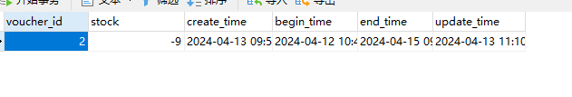

订单量为109


## 解决超卖问题

超卖问题是典型的多线程并发的安全问题，可以通过加锁解决这个问题

- 悲观锁

  认为线程安全问题一定会发生，在操作数据之前先获取锁，确保线程串行执行

  - 例如：Synchronized, lock都属于悲观锁

- 乐观锁

  认为线程安全问题不一定会发生，只是在更新数据时去判断有没有其他线程对数据做修改

  - 如果没有修改则认为是安全的，自己才更新数据
  - 如果已经被其他线程修改说明发生了安全问题，此时可以重试或抛出异常

  

### 乐观锁

**乐观锁**关键是判断之前查询得到的数据是否被修改，常见两种实现方式

- 版本号法

  > 可以使用库存直接代替版本号

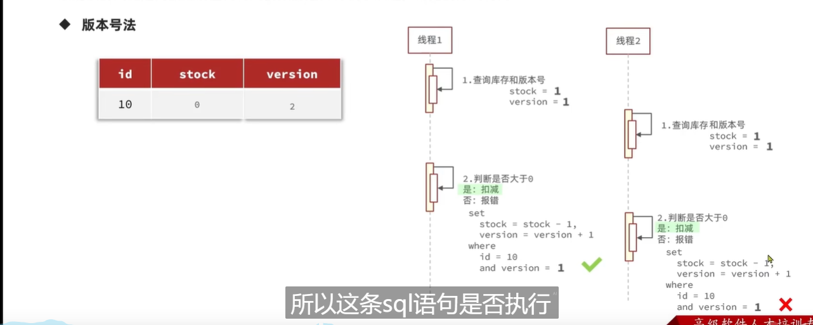


**代码**

```java
/**
 * 秒杀下单
 * @param voucherId
 * @return
 */
@Override
@Transactional
public Result seckillVoucher(Long voucherId) {
    // 查询优惠券
    SeckillVoucher seckillVoucher = seckillVoucherService.getById(voucherId);
    if (seckillVoucher == null) {
        return Result.fail("优惠券不存在");
    }

    // 查询秒杀是否开始
    if (seckillVoucher.getBeginTime().isAfter(LocalDateTime.now())) {
        return Result.fail("秒杀未开始");
    }

    // 查询秒杀是否结束
    if (seckillVoucher.getEndTime().isBefore(LocalDateTime.now())) {
        return Result.fail("秒杀已结束");
    }

    // 查看库存
    if (seckillVoucher.getStock() < 1) {
        return Result.fail("库存不足");
    }

    // 扣减库存
    UpdateWrapper<SeckillVoucher> updateWrapper = new UpdateWrapper<>();
    updateWrapper.setSql("stock = stock - 1");
    updateWrapper.eq("voucher_id", voucherId);
    // 更新前的库存量和查询时的库存量一致时才更新
    updateWrapper.eq("stock", seckillVoucher.getStock());
    if (!seckillVoucherService.update(updateWrapper)) {
        return Result.fail("秒杀失败");
    }

    // 创建订单
    VoucherOrder order = new VoucherOrder();
    // 订单id由全局id生成器生成
    order.setId(redisWork.nextId(RedisConstants.INCR_KEY + "VoucherOrder:"));
    // 用户id
    order.setUserId(UserHolder.getUser().getId());
    // 优惠券id
    order.setVoucherId(seckillVoucher.getVoucherId());

    boolean saveResult = this.save(order);
    return saveResult ? Result.ok("秒杀成功") : Result.fail("秒杀失败");
}
```

### 测试

依旧使用200个线程同时抢100张秒杀卷

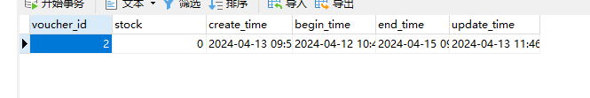


测试结果表明没有出现超卖的现象

**但也会出现一种情况**

如果有大量的请求因为==更新前和查询时的库存量不一样==，导致购票失败，会出现有票剩余但没人抢的情况

**解决问题**

```java
// 扣减库存
UpdateWrapper<SeckillVoucher> updateWrapper = new UpdateWrapper<>();
updateWrapper.setSql("stock = stock - 1");
updateWrapper.eq("voucher_id", voucherId);
// 只要库存量大于0就能更新
updateWrapper.gt("stock", 0);
```


## 一人一单

在电商网站中，一个账号只能抢一张同类型的秒杀券

### 简单实现

```java
/**
  * 秒杀下单
  * @param voucherId
  * @return
*/
@Override
@Transactional
public Result seckillVoucher(Long voucherId) {
    // 查询优惠券
    SeckillVoucher seckillVoucher = seckillVoucherService.getById(voucherId);
    if (seckillVoucher == null) {
        return Result.fail("优惠券不存在");
    }

    // 查询秒杀是否开始
    if (seckillVoucher.getBeginTime().isAfter(LocalDateTime.now())) {
        return Result.fail("秒杀未开始");
    }

    // 查询秒杀是否结束
    if (seckillVoucher.getEndTime().isBefore(LocalDateTime.now())) {
        return Result.fail("秒杀已结束");
    }

    // 查看库存
    if (seckillVoucher.getStock() < 1) {
        return Result.fail("库存不足");
    }

    // 一人一单
    QueryWrapper<VoucherOrder> queryWrapper = new QueryWrapper<>();
    queryWrapper.eq("user_id", UserHolder.getUser().getId());
    queryWrapper.eq("voucher_id", voucherId);
    Long count = voucherOrderMapper.selectCount(queryWrapper);
    if (count > 0) {
        return Result.fail("用户已购买该秒杀券");
    }

    // 扣减库存
    UpdateWrapper<SeckillVoucher> updateWrapper = new UpdateWrapper<>();
    updateWrapper.setSql("stock = stock - 1");
    updateWrapper.eq("voucher_id", voucherId);
    // 只要库存量大于0就能更新
    updateWrapper.gt("stock", 0);
    if (!seckillVoucherService.update(updateWrapper)) {
        return Result.fail("秒杀失败");
    }

    // 创建订单
    VoucherOrder order = new VoucherOrder();
    // 订单id由全局id生成器生成
    order.setId(redisWork.nextId(RedisConstants.INCR_KEY + "VoucherOrder:"));
    // 用户id
    order.setUserId(UserHolder.getUser().getId());
    // 优惠券id
    order.setVoucherId(seckillVoucher.getVoucherId());

    boolean saveResult = this.save(order);
    return saveResult ? Result.ok("秒杀成功") : Result.fail("秒杀失败");
}
```

#### 测试

（同一个用户）200个线程抢100张优惠券

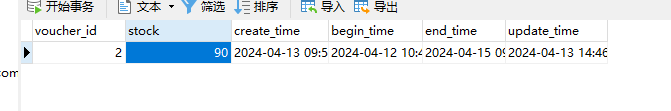

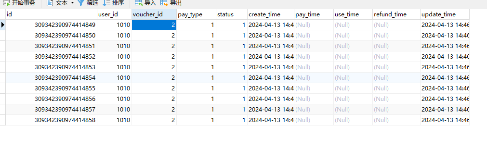

结果还是让一个用户抢了10张票


### synchronized

==注意看注释==

```java
/**
 * 秒杀下单
 * @param voucherId
 * @return
 */
@Override
public Result seckillVoucher(Long voucherId) {
    // 查询优惠券
    SeckillVoucher seckillVoucher = seckillVoucherService.getById(voucherId);
    if (seckillVoucher == null) {
        return Result.fail("优惠券不存在");
    }

    // 查询秒杀是否开始
    if (seckillVoucher.getBeginTime().isAfter(LocalDateTime.now())) {
        return Result.fail("秒杀未开始");
    }

    // 查询秒杀是否结束
    if (seckillVoucher.getEndTime().isBefore(LocalDateTime.now())) {
        return Result.fail("秒杀已结束");
    }

    // 查看库存
    if (seckillVoucher.getStock() < 1) {
        return Result.fail("库存不足");
    }

    long userId = UserHolder.getUser().getId();
    // 只有同一个用户多次抢票才加锁
    // 根据UserHolder.getUser().getId().toString().intern()获取锁
    synchronized (String.valueOf(userId).intern()) {
        // 为什么是UserHolder.getUser().getId().toString().intern()
        // Long调用toString()方法会返回新的字符串对象
        // intern()会去找字符串常量池，存在则直接返回，不存在则往常量池中创建字符串内容的对象

        // 函数createVoucherOrder为什么不直接加上synchronized
        // 如果函数直接加上synchronized，就会使得每个用户的抢票操作变成串行执行

        // 为什么不直接在createVoucherOrder函数里写synchronized程序
        // 因为函数createVoucherOrder添加了事物回滚，只有当函数执行完毕后才会提交事物
        // 如果将synchronized这段程序写到函数里，就会造成先释放锁再提交事物的情况

        IVoucherOrderService voucherOrderService = (IVoucherOrderService) AopContext.currentProxy();
        return voucherOrderService.createVoucherOrder(voucherId);
        // 为什么要这样写
        // 直接返回createVoucherOrder(voucherId)会使事物回滚不生效
        // createVoucherOrder(voucherId)相当于this.createVoucherOrder(voucherId
        // 实际上没有用到proxy代理对象增强的createVoucherOrder
        // 主类加上@EnableAspectJAutoProxy(exposeProxy = true)
    }
}

/**
 * 创建订单
 * @param voucherId
 * @return
 */
@Override
@Transactional(rollbackFor = RuntimeException.class)
public Result createVoucherOrder(Long voucherId) {
    Long userId = UserHolder.getUser().getId();

    // 一人一单
    QueryWrapper<VoucherOrder> queryWrapper = new QueryWrapper<>();
    queryWrapper.eq("user_id", userId);
    queryWrapper.eq("voucher_id", voucherId);
    Long count = voucherOrderMapper.selectCount(queryWrapper);
    if (count > 0) {
        return Result.fail("用户已购买该秒杀券");
    }

    // 扣减库存
    UpdateWrapper<SeckillVoucher> updateWrapper = new UpdateWrapper<>();
    updateWrapper.setSql("stock = stock - 1");
    updateWrapper.eq("voucher_id", voucherId);
    // 只要库存量大于0就能更新
    updateWrapper.gt("stock", 0);
    if (!seckillVoucherService.update(updateWrapper)) {
        return Result.fail("秒杀失败");
    }

    // 创建订单
    VoucherOrder order = new VoucherOrder();
    // 订单id由全局id生成器生成
    order.setId(redisWork.nextId(RedisConstants.INCR_KEY + "VoucherOrder:"));
    // 用户id
    order.setUserId(userId);
    // 优惠券id
    order.setVoucherId(voucherId);

    boolean saveResult = this.save(order);
    return saveResult ? Result.ok("秒杀成功") : Result.fail("秒杀失败");
}
```

> 通过加锁可以解决在单机情况下的一人一单的安全问题，但在集群模式下就不行了


#### 布置集群

访问`/backend`，负载均衡到端口号为8081和端口号为8082的服务器

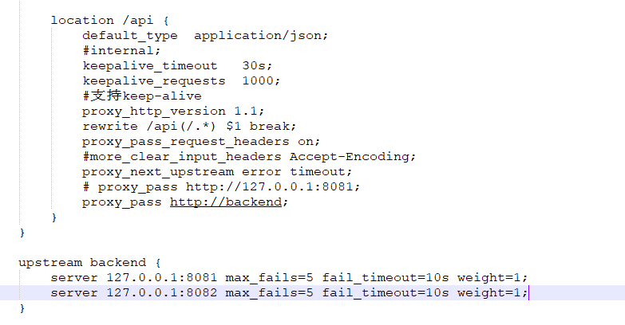

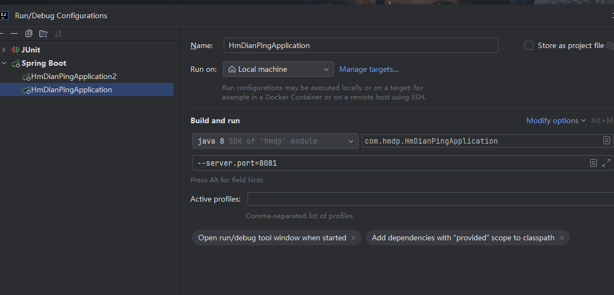

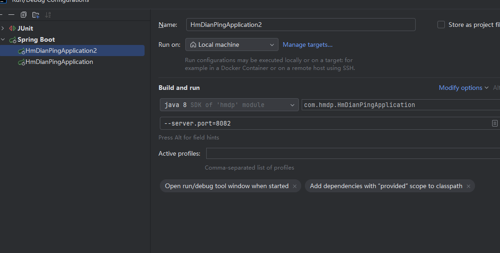

#### 集群下测试synchronized

（同一个用户）10个线程去抢秒杀券

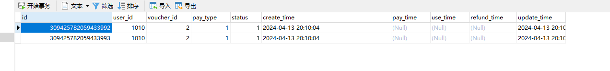

最后一个用户获得了两张秒杀券

> 集群模式下，会存在多个JVM，每个JVM都不会互相影响，它们有各自的堆栈和常量池
>
> jvm1的常量池存储了用户id，jvm2的常量池未必存储了用户id
>
> 所以会出现两个线程同时获取锁的情况


### 分布式锁

满足分布式系统或集群模式下==多进程可见并且互斥==的锁

#### 误删问题

-  在前面使用互斥锁解决缓存击穿问题，如果线程执行过程中**抛出异常**（就算不拿到锁的线程），就会**释放锁**
- 线程1拿到了锁，执行业务过程中发生阻塞，导致锁因过期而释放，线程2拿到了锁，**线程1业务完成释放了线程2的锁**

==解决方案==

获取锁后，存储一个唯一标识（UUID+线程号）

释放锁时，判断锁是不是自己的


#### 分布式锁原子性问题

如果线程判断了这个锁是自己的，业务因为gc进入阻塞，等线程唤醒后又会把其他线程的锁释放

> 判断和释放是原子操作

==解决方案==

Redis提供**Lua脚本功能**，在一个脚本上写多条Redis命令，确保多命令执行时的原子性


### lua脚本

**lua执行redi命令**

```lua
-- 执行redis命令
redis.call('命令名称', 'key', '其他参数'....)
```

例如：我要执行`set name jack`，脚本是这样的

```lua
-- 执行set name jack
redis.call('set', 'name', 'jack')
```

例如：先执行`set name Rose`，再执行`get name`

```lua
-- 先执行set name Rose
redis.call('set', 'name', 'Rose')
-- 再执行get name
local name = redis.call('get', 'name')
return name
```


****

redis提供`eval`命令来执行**lua脚本**

- `script`: 表示lua脚本语句
- numKeys: key的数量
- lua脚本中可通过==KEYS[]和ARGV[]==来访问key和arg（数组下标从1开始）

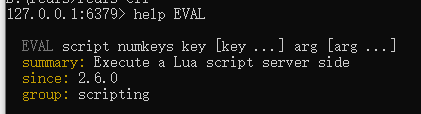

执行`set name jack`

```bash
$ eval "return redis.call('set', 'name', 'jack')" 0
```

传参

```bash
$ eval "return redis.call('set', KEYS[1], ARGV[1])" 1 name jack
```


### SpringBoot使用lua脚本

释放锁的业务流程

1. 获取锁中的线程标识

   > 线程标识：UUID+线程号

2. 判断是否与锁的线程标识一致

3. 如果一致就释放锁

4. 如果不一致就什么都不做

#### RedisTemplate执行lua脚本

```java
/*
 * (non-Javadoc)
 * @see org.springframework.data.redis.core.RedisOperations#execute(org.springframework.data.redis.core.script.RedisScript, java.util.List, java.lang.Object[])
 */
@Override
public <T> T execute(RedisScript<T> script, List<K> keys, Object... args) {
    return scriptExecutor.execute(script, keys, args);
}
```

#### RedisScript

- Resource资源文件（即lua脚本）
- resultType: lua脚本执行后返回的结果类型

```java
static <T> RedisScript<T> of(Resource resource, Class<T> resultType) {

    Assert.notNull(resource, "Resource must not be null!");
    Assert.notNull(resultType, "ResultType must not be null!");

    DefaultRedisScript<T> script = new DefaultRedisScript<>();
    script.setResultType(resultType);
    script.setLocation(resource);

    return script;
}
```

#### 分布式锁实现

```java
package com.hmdp.utils;


import com.hmdp.constant.RedisConstants;
import org.springframework.core.io.ClassPathResource;
import org.springframework.data.redis.core.StringRedisTemplate;
import org.springframework.data.redis.core.script.DefaultRedisScript;
import org.springframework.data.redis.core.script.RedisScript;
import org.springframework.stereotype.Component;

import java.util.Collections;
import java.util.UUID;
import java.util.concurrent.TimeUnit;

@Component
public class DistributedLock {

    private StringRedisTemplate stringRedisTemplate;

    private static final String uuid = UUID.randomUUID().toString().replaceAll("-", "");
    private static final RedisScript<Long> redisScript;
    static {
        // 得到lua脚本
        // 脚本文件放在/resource/lua/unlock.lua
        redisScript = RedisScript.of(new ClassPathResource("/lua/unlock.lua"), Long.class);
    }

    public DistributedLock(StringRedisTemplate stringRedisTemplate) {
        this.stringRedisTemplate = stringRedisTemplate;
    }

    public boolean tryLock(String key) {
        // 尝试获取分布式锁，并设置过期时间
        Boolean result = stringRedisTemplate.opsForValue()
                .setIfAbsent(key, uuid + ":" + Thread.currentThread().getId(),
                        RedisConstants.DISTRIBUTED_LOCK_TTL, TimeUnit.MINUTES);

        return result != null ? result : false;
    }

    public void unlock(String key) {
        Long execute = stringRedisTemplate.execute(redisScript, Collections.singletonList(key),
                uuid + ":" + Thread.currentThread().getId());
    }
}
```


#### 释放锁的lua脚本

> 脚本文件放在`/resource/lua/unlock.lua`

```lua
-- 锁的key
local key = KEYS[1]
-- 当前线程标识
local threaId = ARGV[1]

if (redis.call('get', key) == threaId) then
    return redis.call('del', key)
end

return 0
```


#### 分布式锁实现一人一单

> 只显示部分源代码

```java
long userId = UserHolder.getUser().getId();
String distributedLockKey = RedisConstants.DISTRIBUTED_LOCK_KEY +
        "voucher:" + voucherId + ":user" + userId;
// 获取分布式锁
// 获取失败，直接返回
if (!distributedLock.tryLock(distributedLockKey)) {
    return Result.fail("不允许重复下单");
}

try {
    // 创建订单
    IVoucherOrderService voucherOrderService = (IVoucherOrderService) AopContext.currentProxy();
    Result voucherOrder = voucherOrderService.createVoucherOrder(voucherId);
    return voucherOrder;
} finally {
    // 释放锁
    distributedLock.unlock(distributedLockKey);
}
```


#### 测试

（同一个用户）使用1000个进程抢秒杀券

最终实现一人一单


# 介绍Redisson

## 配置

```xml
<!--Redisson客户端（java控制redis）-->
<!--https://github.com/redisson/redisson-->
<dependency>
    <groupId>org.redisson</groupId>
    <artifactId>redisson</artifactId>
    <version>3.16.2</version>
</dependency>
```

```java
package com.li.ParnerMatching.config;

import org.redisson.Redisson;
import org.redisson.api.RedissonClient;
import org.redisson.config.Config;
import org.springframework.boot.context.properties.ConfigurationProperties;
import org.springframework.context.annotation.Bean;
import org.springframework.context.annotation.Configuration;

@Configuration
@ConfigurationProperties(prefix = "spring.redis")
public class RedissonConfig {

    // 从yml文件中读取主机名
    private String host;
    // 从yml文件中读取端口名
    private String port;

    public void setHost(String host) {
        this.host = host;
    }

    public void setPort(String port) {
        this.port = port;
    }

    @Bean
    public RedissonClient redissonClient() {
        // 创建配置
        Config config = new Config();

        String redisAddress = String.format("redis://%s:%s", host, port);
        config.useSingleServer().setAddress(redisAddress).setDatabase(1);

        // 创建实例
        RedissonClient redissonClient = Redisson.create(config);

        return redissonClient;
    }
}
```


## 基于Redis的分布式锁优化

基于`setnx`实现的分布式锁存在以下问题：

- 不可重入：同一个线程无法多次获取同一把锁
- 不可重试：获取锁只尝试一次就返回
- 超时释放：锁超时释放虽然可以避免死锁，但如果业务执行耗时较长，也会导致锁释放，存在安全隐患

- 主从一致性：如果Redis提供了主从集群，主从同步存在延迟，当主节点宕机时（会从从节点里选一个节点成为主节点），如果从节点没有同步主节点的锁数据，其他线程就会得到锁

  > 主从集群：读写分离，主节点执行写操作，从节点执行读操作


## 可重入锁

一个线程可以获取多次同一个锁

==内部结构是Redis的Hash类型==

**RedissonClient**是一个接口，它的实现类**Redisson**

通过`redissonClient.getLock(key)`可以获取到可重入锁`RedissonLock`

`RedissonLock`调用`tryLock`方法

```java
<T> RFuture<T> tryLockInnerAsync(long waitTime, long leaseTime, TimeUnit unit, long threadId, RedisStrictCommand<T> command) {
    return evalWriteAsync(getRawName(), LongCodec.INSTANCE, command,
             // 如果锁不存在
            "if (redis.call('exists', KEYS[1]) == 0) then " +
                    // 创建锁，并添加线程标识，记录该线程获取锁的次数
                    "redis.call('hincrby', KEYS[1], ARGV[2], 1); " +
                    // 设置过期时间
                    "redis.call('pexpire', KEYS[1], ARGV[1]); " +
                    "return nil; " +
                    "end; " +
                     // 如果线程获取过锁
                    "if (redis.call('hexists', KEYS[1], ARGV[2]) == 1) then " +
                     // 线程获取锁次数+1
                    "redis.call('hincrby', KEYS[1], ARGV[2], 1); " +
                     // 更新锁的过期时间
                    "redis.call('pexpire', KEYS[1], ARGV[1]); " +
                    "return nil; " +
                    "end; " +
                    // 返回锁的过期时间（单位milliseconds）
                    "return redis.call('pttl', KEYS[1]);",
            Collections.singletonList(getRawName()), unit.toMillis(leaseTime), getLockName(threadId));
}
```

`RedissonLock`调用`unLock`方法

```java
protected RFuture<Boolean> unlockInnerAsync(long threadId) {
    return evalWriteAsync(getRawName(), LongCodec.INSTANCE, RedisCommands.EVAL_BOOLEAN,
            // 如果该线程没有获取到锁
            "if (redis.call('hexists', KEYS[1], ARGV[3]) == 0) then " +
                    "return nil;" +
                    "end; " +
                    // 线程访问锁的次数-1
                    "local counter = redis.call('hincrby', KEYS[1], ARGV[3], -1); " +
                    "if (counter > 0) then " +
                     // 更新过期时间
                    "redis.call('pexpire', KEYS[1], ARGV[2]); " +
                    "return 0; " +
                    "else " +
                     // 删除锁
                    "redis.call('del', KEYS[1]); " +
                     // 发布通知：没有锁
                    "redis.call('publish', KEYS[2], ARGV[1]); " +
                    "return 1; " +
                    "end; " +
                    "return nil;",
            Arrays.asList(getRawName(), getChannelName()), LockPubSub.UNLOCK_MESSAGE, internalLockLeaseTime, getLockName(threadId));
}
```


## RedissonLock重试机制

当前获取锁不成功，等待一定时间（看看能不能获取到锁）（==主打一个坚持不懈==）

```java
@Override
public boolean tryLock(long waitTime, long leaseTime, TimeUnit unit) throws InterruptedException {
    long time = unit.toMillis(waitTime);
    long current = System.currentTimeMillis();
    long threadId = Thread.currentThread().getId();
    Long ttl = tryAcquire(waitTime, leaseTime, unit, threadId);
    // 获取锁成功
    if (ttl == null) {
        return true;
    }

    time -= System.currentTimeMillis() - current;
    if (time <= 0) {
        acquireFailed(waitTime, unit, threadId);
        return false;
    }

    current = System.currentTimeMillis();
    // 等待锁被释放（订阅消息）
    RFuture<RedissonLockEntry> subscribeFuture = subscribe(threadId);
    // 在规定时间内没有得到消息
    if (!subscribeFuture.await(time, TimeUnit.MILLISECONDS)) {
        if (!subscribeFuture.cancel(false)) {
            subscribeFuture.onComplete((res, e) -> {
                if (e == null) {
                    unsubscribe(subscribeFuture, threadId);
                }
            });
        }
        acquireFailed(waitTime, unit, threadId);
        return false;
    }

    try {
        time -= System.currentTimeMillis() - current;
        if (time <= 0) {
            acquireFailed(waitTime, unit, threadId);
            return false;
        }
		
        // 只要等待时间过长，不断去尝试获取锁
        while (true) {
            long currentTime = System.currentTimeMillis();
            ttl = tryAcquire(waitTime, leaseTime, unit, threadId);
            // lock acquired
            if (ttl == null) {
                return true;
            }

            time -= System.currentTimeMillis() - currentTime;
            if (time <= 0) {
                acquireFailed(waitTime, unit, threadId);
                return false;
            }

            // waiting for message
            currentTime = System.currentTimeMillis();
            if (ttl >= 0 && ttl < time) {
                subscribeFuture.getNow().getLatch().tryAcquire(ttl, TimeUnit.MILLISECONDS);
            } else {
                subscribeFuture.getNow().getLatch().tryAcquire(time, TimeUnit.MILLISECONDS);
            }

            time -= System.currentTimeMillis() - currentTime;
            if (time <= 0) {
                acquireFailed(waitTime, unit, threadId);
                return false;
            }
        }
    } finally {
        unsubscribe(subscribeFuture, threadId);
    }
    //        return get(tryLockAsync(waitTime, leaseTime, unit));
}
```


## RedissonLock看门狗机制

### 获取锁

> 当过期时间为-1或没有设置过期时间，触发看门狗机制

```java
private <T> RFuture<Long> tryAcquireAsync(long waitTime, long leaseTime, TimeUnit unit, long threadId) {
    RFuture<Long> ttlRemainingFuture;
    if (leaseTime != -1) {
        // 创建锁时设置过期时间
        ttlRemainingFuture = tryLockInnerAsync(waitTime, leaseTime, unit, threadId, RedisCommands.EVAL_LONG);
    } else {
         // 没有设置过期时间，默认30s(internalLockLeaseTime)
        ttlRemainingFuture = tryLockInnerAsync(waitTime, internalLockLeaseTime,
                TimeUnit.MILLISECONDS, threadId, RedisCommands.EVAL_LONG);
    }
    ttlRemainingFuture.onComplete((ttlRemaining, e) -> {
        // 有异常
        if (e != null) {
            return;
        }

        // 拿到锁
        if (ttlRemaining == null) {
            if (leaseTime != -1) {
                // 修改internalLockLeaseTime
                // 默认30s
                internalLockLeaseTime = unit.toMillis(leaseTime);
            } else {
                // 触发看门狗机制
                // 更新过期时间
                scheduleExpirationRenewal(threadId);
            }
        }
    });
    return ttlRemainingFuture;
}
```

```java
protected void scheduleExpirationRenewal(long threadId) {
    // ExpirationEntry类似于可重入锁里的Hash结构
    ExpirationEntry entry = new ExpirationEntry();
    // getEntryName(): 可以理解为锁的key
    ExpirationEntry oldEntry = EXPIRATION_RENEWAL_MAP.putIfAbsent(getEntryName(), entry);
    if (oldEntry != null) {
        oldEntry.addThreadId(threadId);
    } else {
        entry.addThreadId(threadId);
        // 更新过期时间
        renewExpiration();
    }
}
```

```java
private void renewExpiration() {
    ExpirationEntry ee = EXPIRATION_RENEWAL_MAP.get(getEntryName());
    if (ee == null) {
        return;
    }
    
    // 延迟任务
    // 每到internalLockLeaseTime / 3 MILLISECONDS就会执行
    Timeout task = commandExecutor.getConnectionManager().newTimeout(new TimerTask() {
        @Override
        public void run(Timeout timeout) throws Exception {
            ExpirationEntry ent = EXPIRATION_RENEWAL_MAP.get(getEntryName());
            if (ent == null) {
                return;
            }
            Long threadId = ent.getFirstThreadId();
            if (threadId == null) {
                return;
            }
            
            // 执行lua脚本
            // 更新过期时间
            RFuture<Boolean> future = renewExpirationAsync(threadId);
            future.onComplete((res, e) -> {
                // 有异常
                if (e != null) {
                    log.error("Can't update lock " + getRawName() + " expiration", e);
                    // 直接移除ExpirationEntry
                    EXPIRATION_RENEWAL_MAP.remove(getEntryName());
                    return;
                }
                
                // 更新成功
                if (res) {
                    // 持续更新过期时间
                    renewExpiration();
                } else {
                    // 取消更新过期时间
                    cancelExpirationRenewal(null);
                }
            });
        }
    }, internalLockLeaseTime / 3, TimeUnit.MILLISECONDS);
    
    ee.setTimeout(task);
}
```


### 释放锁

```java
@Override
public RFuture<Void> unlockAsync(long threadId) {
    RPromise<Void> result = new RedissonPromise<>();
    // 线程threadId释放锁
    RFuture<Boolean> future = unlockInnerAsync(threadId);

    future.onComplete((opStatus, e) -> {
        // 线程threadId释放锁
        cancelExpirationRenewal(threadId);

        if (e != null) {
            result.tryFailure(e);
            return;
        }
		
        // 线程获取的锁不存在
        if (opStatus == null) {
            IllegalMonitorStateException cause = new IllegalMonitorStateException("attempt to unlock lock, not locked by current thread by node id: "
                    + id + " thread-id: " + threadId);
            result.tryFailure(cause);
            return;
        }

        result.trySuccess(null);
    });

    return result;
}
```

```java
protected RFuture<Boolean> unlockInnerAsync(long threadId) {
    return evalWriteAsync(getRawName(), LongCodec.INSTANCE, RedisCommands.EVAL_BOOLEAN,
                     // 线程获取的锁不存在
            "if (redis.call('hexists', KEYS[1], ARGV[3]) == 0) then " +
                    "return nil;" +
                    "end; " +
                     // 线程拥有该锁的数量-1
                    "local counter = redis.call('hincrby', KEYS[1], ARGV[3], -1); " +
                    "if (counter > 0) then " +
                     // 数量>0更新过期时间
                    "redis.call('pexpire', KEYS[1], ARGV[2]); " +
                    "return 0; " +
                    "else " +
                     // 删除锁
                    "redis.call('del', KEYS[1]); " +
                     // 发布消息
                    "redis.call('publish', KEYS[2], ARGV[1]); " +
                    "return 1; " +
                    "end; " +
                    "return nil;",
            Arrays.asList(getRawName(), getChannelName()), LockPubSub.UNLOCK_MESSAGE, internalLockLeaseTime, getLockName(threadId));
}
```


```java
protected void cancelExpirationRenewal(Long threadId) {
    ExpirationEntry task = EXPIRATION_RENEWAL_MAP.get(getEntryName());
    if (task == null) {
        return;
    }
    
    if (threadId != null) {
        task.removeThreadId(threadId);
    }

    // 当threadId为空或task没有值的时候
    // 结束任务（更新过期时间）、移除ExpirationEntry
    if (threadId == null || task.hasNoThreads()) {
        Timeout timeout = task.getTimeout();
        if (timeout != null) {
            timeout.cancel();
        }
        EXPIRATION_RENEWAL_MAP.remove(getEntryName());
    }
}
```


### 总结

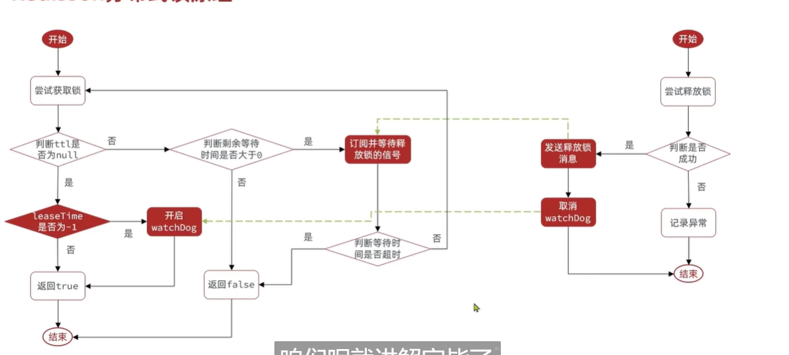


## 主从一致性问题

### 构建Redis分片集群

在`redis`文件夹中创建二级目录，对应不同端口的Redis服务器

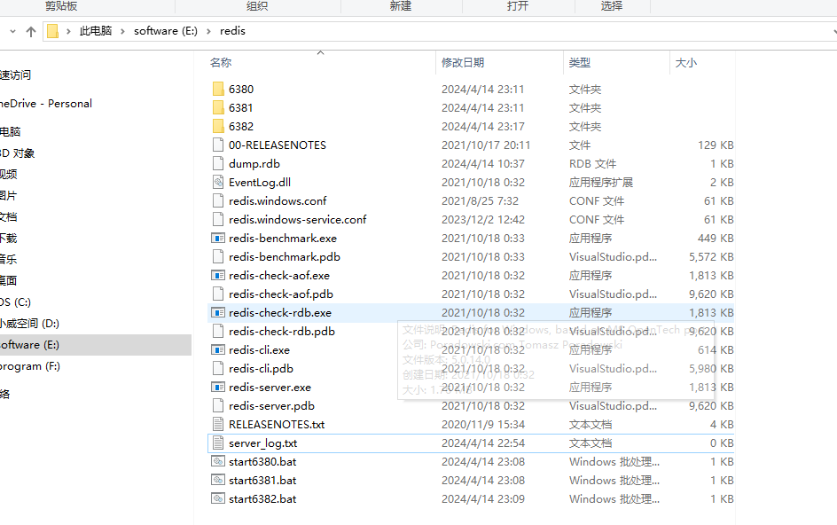

在新建的文件夹中创建`redis-6380.conf`

```
# 绑定id
bind 0.0.0.0
# 端口号
port 6380
# 是否是守护进程
daemonize yes

# 是否开启集群
cluster-enabled yes

# 本地数据库存放路径，默认./
dir "./6380"
# (启动自动生成)节点信息，只能是文件，不能是路径，会创建在dir下
cluster-config-file node-6380.conf
cluster-node-timeout 150000
# 启用aof持久化方式
appendonly no
# 日志文件位置
logfile "E:/redis/6380/redis-6380.log"
```

使用以下命令启动端口号为6380, 6381, 6382的Redis服务器

可以将以下命令分别写在`.bat`的文件下

```bash
$ redis-server.exe ./6380/redis-6380.conf
$ redis-server.exe ./6381/redis-6380.conf
$ redis-server.exe ./6382/redis-6380.conf
```

启动成功后，输入以下命令，构建集群

对==127.0.0.1:6380, 127.0.0.1:6381, 127.0.0.1:6382==Redis服务器构建集群

**--cluster-replicas**表示一台主节点有多少台从节点（自动分配）

```bash
$ redis-cli --cluster create 192.168.70.128:6380 192.168.70.128:6381 192.168.70.128:6382 --cluster-replicas 0
```

==注意==

- 不要将192.168.70.128写成127.0.0.1，会导致后端无法访问到redis分片集群

### RedissonMultiLock

执行`redissonClient.getMultiLock(lock1, lock2...)`获得多重锁

```java
@Override
public RLock getMultiLock(RLock... locks) {
    return new RedissonMultiLock(locks);
}
```

**源码分析**

```java
    @Override
    public boolean tryLock(long waitTime, long leaseTime, TimeUnit unit) throws InterruptedException {
//        try {
//            return tryLockAsync(waitTime, leaseTime, unit).get();
//        } catch (ExecutionException e) {
//            throw new IllegalStateException(e);
//        }
        long newLeaseTime = -1;
        // 超时时间设置
        if (leaseTime != -1) {
            if (waitTime == -1) {
                newLeaseTime = unit.toMillis(leaseTime);
            } else {
                newLeaseTime = unit.toMillis(waitTime)*2;
            }
        }
        
        long time = System.currentTimeMillis();
        // 剩余等待时间设置
        long remainTime = -1;
        if (waitTime != -1) {
            remainTime = unit.toMillis(waitTime);
        }
        // calcLockWaitTime返回remainTime
        long lockWaitTime = calcLockWaitTime(remainTime);
        
        // 获取锁失败的次数（failedLocksLimit返回0）
        int failedLocksLimit = failedLocksLimit();
        List<RLock> acquiredLocks = new ArrayList<>(locks.size());
        // 尝试在每台Redis服务器上获取锁
        for (ListIterator<RLock> iterator = locks.listIterator(); iterator.hasNext();) {
            RLock lock = iterator.next();
            boolean lockAcquired;
            try {
                // 获取锁
                if (waitTime == -1 && leaseTime == -1) {
                    lockAcquired = lock.tryLock();
                } else {
                    long awaitTime = Math.min(lockWaitTime, remainTime);
                    lockAcquired = lock.tryLock(awaitTime, newLeaseTime, TimeUnit.MILLISECONDS);
                }
            } catch (RedisResponseTimeoutException e) {
                // 出现异常释放所有锁
                unlockInner(Arrays.asList(lock));
                lockAcquired = false;
            } catch (Exception e) {
                lockAcquired = false;
            }
            
            if (lockAcquired) {
                // 一台Redis服务器获取锁成功，添加到成功列表
                acquiredLocks.add(lock);
            } else {
                // 获取锁失败，失败次数在允许的范围，退出循环
                if (locks.size() - acquiredLocks.size() == failedLocksLimit()) {
                    break;
                }

                // 不允许出现锁获取失败的情况
                if (failedLocksLimit == 0) {
                    // 释放所有Redis服务器中获取成功的锁
                    unlockInner(acquiredLocks);
                    // 只尝试一次，直接返回false
                    if (waitTime == -1) {
                        return false;
                    }
                    
                    // 重新设置允许失败次数
                    failedLocksLimit = failedLocksLimit();
                    // 清空成功列表
                    acquiredLocks.clear();
                    // 指针前移
                    while (iterator.hasPrevious()) {
                        iterator.previous();
                    }
                } else {
                    failedLocksLimit--;
                }
            }
            
            // waitTime为-1时，表示不断重试
            // waitTime不为-1时，需要判断能否继续获取锁
            if (remainTime != -1) {
                remainTime -= System.currentTimeMillis() - time;
                time = System.currentTimeMillis();
                // 剩余时间<=0
                if (remainTime <= 0) {
                    // 释放所有Redis服务器中获取成功的锁
                    unlockInner(acquiredLocks);
                    return false;
                }
            }
        }

        // leaseTime为-1时，启动看门狗机制
        // 所有Redis服务器上的锁超时时间再次统一设置
        if (leaseTime != -1) {
            acquiredLocks.stream()
                    .map(l -> (RedissonLock) l)
                    .map(l -> l.expireAsync(unit.toMillis(leaseTime), TimeUnit.MILLISECONDS))
                    .forEach(f -> f.syncUninterruptibly());
        }
        
        return true;
    }
```


# 秒杀券优化

- 新增秒杀优惠券的同时，将优惠券信息保存到Redis
- 基于lua脚本，判断秒杀库存、一人一单，决定用户是否抢购成功
- 如果抢购成功，将优惠券id和用户id封装后存入阻塞队列
- 开启线程任务，实现异步创建订单功能

## 部分操作转为lua脚本

### 实现思路

- 将优惠券信息提前缓存到redis（添加优惠券时缓存到redis），并根据优惠券的结束时间确定数据的过期时间
- 在redis中添加一个列表，存储已购优惠券的用户id，并根据优惠券的结束时间确定数据的过期时间
- 在lua脚本中，判断用户是否能购买优惠券，并在redis中扣除缓存，将用户id添加到已购列表
- mysql数据库执行扣减缓存、创建订单，保证数据一致性

### 原实现

```java
// 查询优惠券
SeckillVoucher seckillVoucher = seckillVoucherService.getById(voucherId);
if (seckillVoucher == null) {
    return Result.fail("优惠券不存在");
}

// 查询秒杀是否开始
if (seckillVoucher.getBeginTime().isAfter(LocalDateTime.now())) {
    return Result.fail("秒杀未开始");
}

// 查询秒杀是否结束
if (seckillVoucher.getEndTime().isBefore(LocalDateTime.now())) {
    return Result.fail("秒杀已结束");
}

// 查看库存
if (seckillVoucher.getStock() < 1) {
    return Result.fail("库存不足");
}

// 创建订单时的一人一单
QueryWrapper<VoucherOrder> queryWrapper = new QueryWrapper<>();
queryWrapper.eq("user_id", userId);
queryWrapper.eq("voucher_id", voucherId);
Long count = voucherOrderMapper.selectCount(queryWrapper);
if (count > 0) {
    return Result.fail("用户已购买该秒杀券");
}
```

### 创建秒杀券（变化）

```java
@Override
@Transactional
public void addSeckillVoucher(Voucher voucher) {
    // 保存优惠券
    save(voucher);
    // 保存秒杀信息
    SeckillVoucher seckillVoucher = new SeckillVoucher();
    seckillVoucher.setVoucherId(voucher.getId());
    seckillVoucher.setStock(voucher.getStock());
    seckillVoucher.setBeginTime(voucher.getBeginTime());
    seckillVoucher.setEndTime(voucher.getEndTime());
    seckillVoucherService.save(seckillVoucher);

    // 将秒杀券存入缓存
    Map<String, String> seckillVoucherMap = getSeckillVoucherMap(seckillVoucher);
    // 优惠券key
    String seckillVoucherKey = RedisConstants.CACHE_SECKILL_KEY + voucher.getId();
    // 已购优惠券用户列表key
    String seckillVoucherUserSetKey = RedisConstants.BOUGH_SECKILL_USER_Set_KEY + voucher.getId();

    // 将秒杀券信息存入缓存
    stringRedisTemplate.opsForHash().putAll(seckillVoucherKey, seckillVoucherMap);
    // 将已购优惠券的用户信息存入
    stringRedisTemplate.opsForSet().add(seckillVoucherUserSetKey, String.valueOf(0));
    // 设置过期时间（结束时间）
    long now = LocalDateTime.now().toEpochSecond(ZoneOffset.UTC);
    long endTime = seckillVoucher.getEndTime().toEpochSecond(ZoneOffset.UTC);
    stringRedisTemplate.expire(seckillVoucherKey, endTime-now, TimeUnit.SECONDS);
    stringRedisTemplate.expire(seckillVoucherUserSetKey, endTime-now, TimeUnit.SECONDS);
}
```

### lua脚本

==读取lua脚本文件==

```java
private static final RedisScript<Long> redisScript;
static {
    // 得到lua脚本
    // 以下脚本执行：优惠券存在、优惠券时间、库存足够、一人一单
    // 如果以上条件满足，就执行：扣缓存、用户下单（往Set添加用户）
    redisScript = RedisScript.of(new ClassPathResource("/lua/seckillvoucher.lua"), Long.class);
}
```

==lua脚本实现==

```lua
-- 时间字符串转化为时间戳（秒）
local function parseDateTime(dateTimeStr)
    local year, month, day, hour, min, sec = dateTimeStr:match("(%d+)-(%d+)-(%d+)T(%d+):(%d+):(%d+)")
    if not year or not month or not day or not hour or not min or not sec then
        -- 匹配失败，返回nil或处理错误
        return nil
    end
    year, month, day, hour, min, sec = tonumber(year), tonumber(month), tonumber(day), tonumber(hour), tonumber(min), tonumber(sec)

    -- 检查闰年
    local function isLeapYear(y)
        return (y % 4 == 0 and y % 100 ~= 0) or (y % 400 == 0)
    end

    -- 每个月的天数，考虑闰年2月有29天
    local daysInMonth = {31, isLeapYear(year) and 29 or 28, 31, 30, 31, 30, 31, 31, 30, 31, 30, 31}

    -- 计算到1970年以来的天数
    local days = day - 1 -- 当月已过的天数
    for y = 1970, year - 1 do
        days = days + (isLeapYear(y) and 366 or 365)
    end
    for m = 1, month - 1 do
        days = days + daysInMonth[m]
    end

    -- 计算总秒数
    local seconds = (((days * 24 + hour) * 60 + min) * 60 + sec)

    return seconds
end

-- 查询优惠券是否存在
local seckillVoucherKey = KEYS[1]
-- 优惠券存在返回1
if (redis.call('EXISTS', seckillVoucherKey) ~= 1) then
    return nil;
end

-- 当前时间（时间戳，单位：秒）
local currentTime = redis.call('TIME')[1];

-- 查询秒杀是否开始
local beginTimeStr = redis.call('HGET', seckillVoucherKey, 'beginTime');
local beginTime = parseDateTime(beginTimeStr);

if (currentTime - beginTime < 0) then
    return nil;
end

-- 查询秒杀是否结束
local endTimeStr = redis.call('HGET', seckillVoucherKey, 'endTime');
local endTime = parseDateTime(endTimeStr);

if (currentTime - endTime > 0) then
    return nil;
end

-- 查询库存
local stock = tonumber(redis.call('HGET', seckillVoucherKey, 'stock'));
if (stock <= 0) then
    return nil;
end

-- 一人一单
local seckillVoucherUserSetKey = KEYS[2];
local userId = ARGV[1];
if (redis.call('SISMEMBER', seckillVoucherUserSetKey, userId) == 1) then
    return nil;
end

-- 扣库存
redis.call('HINCRBY', seckillVoucherKey, 'stock', -1);

-- 用户下单（将用户添加到已购优惠券列表）
redis.call('SADD', seckillVoucherUserSetKey, userId);

return 0;
```

### 现在的实现

```java
/**
 * 秒杀下单
 * @param voucherId
 * @return
 */
@Override
public Result seckillVoucher(Long voucherId) {
    long userId = UserHolder.getUser().getId();

    // 优惠券key
    String seckillVoucherKey = RedisConstants.CACHE_SECKILL_KEY + voucherId;
    // 已购优惠券用户列表key
    String seckillVoucherUserSetKey = RedisConstants.BOUGH_SECKILL_USER_Set_KEY + voucherId;

    // 执行lua脚本
    Long execute = stringRedisTemplate.execute(redisScript,
            Arrays.asList(seckillVoucherKey, seckillVoucherUserSetKey), String.valueOf(userId));
    if (execute == null) {
        return Result.fail("秒杀失败");
    }

    String distributedLockKey = RedisConstants.DISTRIBUTED_LOCK_KEY +
            "voucher:" + voucherId + ":user" + userId;
    // redisson客户端的分布式锁（可重用）
    RLock lock = redissonClient.getLock(distributedLockKey);
    // 获取分布式锁
    try {
        if (lock.tryLock(0L, RedisConstants.DISTRIBUTED_LOCK_TTL, TimeUnit.MINUTES)) {
            IVoucherOrderService voucherOrderService = (IVoucherOrderService) AopContext.currentProxy();
            Result voucherOrder = voucherOrderService.createVoucherOrder(voucherId);
            return voucherOrder;
        }
    } catch (InterruptedException e) {
        throw new RuntimeException(e);
    } finally {
        if (lock.isHeldByCurrentThread()) {
            lock.unlock();
        }
    }

    // 获取失败，直接返回
    return Result.fail("不允许重复下单");
}

/**
 * 创建订单
 * @param voucherId
 * @return
 */
@Override
@Transactional(rollbackFor = RuntimeException.class)
public Result createVoucherOrder(Long voucherId) {
    Long userId = UserHolder.getUser().getId();

    // 扣减库存
    UpdateWrapper<SeckillVoucher> updateWrapper = new UpdateWrapper<>();
    updateWrapper.setSql("stock = stock - 1");
    updateWrapper.eq("voucher_id", voucherId);
    // 只要库存量大于0就能更新
    updateWrapper.gt("stock", 0);
    if (!seckillVoucherService.update(updateWrapper)) {
        return Result.fail("秒杀失败");
    }

    // 创建订单
    VoucherOrder order = new VoucherOrder();
    // 订单id由全局id生成器生成
    order.setId(redisWork.nextId(RedisConstants.INCR_KEY + "VoucherOrder:"));
    // 用户id
    order.setUserId(userId);
    // 优惠券id
    order.setVoucherId(voucherId);

    boolean saveResult = this.save(order);
    return saveResult ? Result.ok("秒杀成功") : Result.fail("秒杀失败");
}
```


# Redis消息队列

## 简介

### 基于List实现消息队列

Redis的List是一个双端队列，生产者可以往队头插入消息，消费者从队尾获取消息

- 优点：消息持久化
- 缺点：一个消费者从队列中获取了消息，另一个消费者就无法获取到消息了


### 基于PubSub实现消息队列

消费者可以订阅一个或多个频道，生产者向对应频道发送消息，订阅该频道的消费者都可以收到消息

- *subscribe channel[channel]*: 订阅一个或多个频道
- *publish channel msg*: 向一个频道发送消息
- *psubscribe  pattern[pattern]*: 订阅与pattern格式匹配的所有频道

==总结==

- 优点：生产者发送消息，可被多个消费者接收到
- 缺点：消息没有持久化，生产者发送消息后，如果消费者没有及时订阅，消费者就无法获得消息


### 基于Stream的单消费模式

> Redis5.0

**发送消息命令**

```bash
$ XADD key [NOMKSTREAM] [MAXLEN|MINID [=|~] threshold [LIMIT count]] *|ID field value [field value...]
```

- `NOMKSTREAM`: 如果队列不存在，是否自动创建队列，默认是自动创建
- `MAXLEN|MINID [=|~] threshold [LIMIT count]`: 设置消息队列的最大消息数量
- `*|ID`: 消息的唯一id，*代表由Redis自动生成。格式：时间戳-递增数字（1644804662707-0）

**例子**

创建名为users的队列，向其中发送消息，内容*{name=jack, age=21}*，并且由Redis自动生成id

```bash
$ XADD users * name jack age 21
```

****

**读取消息**

```bash
$ XREAD [COUNT count] [BLOCK milliseconds] STREANS key [key...] ID [ID...]
```

- `COUNT count`: 每次读取消息的最大数量
- `BLOCK milliseconds`: 没有消息是，是否阻塞，阻塞时长
- `STREANS key [key...]`: 要从哪个队列读取消息，key就是队列名
- `ID [ID...]`: 起始id，只返回大于该id的消息
  - 0：代表从第一个消息开始
  - $：代表获取最新的一条消息
- `STREANS key [key...]`和`ID [ID...]`的个数应该相等

****

==总结==

- 消息可回溯

  - 消息持久化

- 一个消息可以被多个消费者读取

- 可以阻塞读取

- 有消息漏读的风险

  > 读取消息时使用**$**
  >
  > 由于**$**只读取最新的消息，处理消息过程中又来了几条新消息，再次获取新消息时只能获取到最新的一条消息


### 基于Stream的消费者组模式

**消费者组**：将多个消费者划分到一个组中，监听同一个队列

- **消息分流**：队列中的消息会分流给组内的不同消费者，而不是给每个消费者都发送消息，从而加快消息处理的速度
- **消息标示**：消费者组会维护一个标示，记录最后一个被处理的消息，哪怕消费者宕机重启，还会从标示之后读取消息，确保每个消息都被消费（相当于书签）
- **消息确认**：消费者获取消息后，消息处于`pending`状态，并存入`pending-list`。当处理完成后需要通过*XACK*来确认消息，标记消息为已处理，才会从`pending-list`中移除

****

**创建消费者组**

```bash
$ XGROUP CREATE key groupName ID [MKSTREAM]
```

- *key*: 队列名称
- *groupName*: 消费者组名称
- *ID*: 起始ID标示，$表示队列中最后一个消息，0代表队列中第一个消息
- *MKSTREAM*: 队列不存在时自动创建队列

**其他命令**

```bash
# 删除指定消费者组 
XGROUP DESTORY key groupName
# 给指定的消费者组添加消费者
XGROUP CREATECONSUMER key groupName consumerName
# 删除消费者组中的指定消费者
XGROUP DELCONSUMER key groupName consumerName
```

****

**从消费者组读取消息**

```bash
$ XREADGROUP GROUP group consumer [COUNT count] [BLOCK milliseconds] [NOACK] STREAMS key [key...] ID [ID...] 
```

- *GROUP group*: 消费组名称
- *consumer*: 消费者名称，如果消费者不存在，则创建一个消费者
- *COUNT count*: 本次查询的最大数量
- *BLOCK milliseconds*: 当没有消息时最长等待时间
- *NOACK*: 无需手动ACK，获取到消息后自动确定
- *STREAMS key [key...]*: 指定队列名称
- *ID [ID...]*: 获取消息的起始ID
  - *">"*: 从下一个未消费的消息开始
  - *"0"*: 取`pending list（未确定）`里的消息
- `STREANS key [key...]`和`ID [ID...]`的个数应该相等


## 基于Stream实现异步秒杀

### 步骤

- lua脚本中将创建订单的信息添加到消息队列
- 循环获取消息队列中的订单信息，更新库存、创建订单
- 创建成功后，确认消息`ACK`
- 创建失败，再次发出请求，直到创建成功

### 实现

#### 创建秒杀券（变化）

```java
// 创建消费者组（用作创建订单的消息队列）
// 并自动创建了消息队列
String key = RedisConstants.VOUCHER_ORDER_MESSAGE_LIST_KEY;
stringRedisTemplate.opsForStream().createGroup(key, ReadOffset.from("0"), "g1");
```

#### sckillvoucher.lua（变化）

```lua
-- 添加订单消息到消息队列
local createOrderMessageQueueKey = KEYS[3];

local voucherId = ARGV[2];
local orderId = ARGV[3];
redis.call('XADD', createOrderMessageQueueKey, '*', 'userId', userId, 'voucherId', voucherId, 'orderId', orderId);
```

#### 秒杀券业务

```java
/**
 * 秒杀下单
 * @param voucherId
 * @return
 */
@Override
public Result seckillVoucher(Long voucherId) {
    long userId = UserHolder.getUser().getId();

    // 优惠券key
    String seckillVoucherKey = RedisConstants.CACHE_SECKILL_KEY + voucherId;
    // 已购优惠券用户列表key
    String seckillVoucherUserSetKey = RedisConstants.BOUGH_SECKILL_USER_Set_KEY + voucherId;
    // 订单消息队列Key
    String createOrderMessageQueueKey = RedisConstants.VOUCHER_ORDER_MESSAGE_LIST_KEY;

    // 代理类创建
    this.service = (IVoucherOrderService) AopContext.currentProxy();
    // 执行lua脚本
    // 优惠券是否存在、优惠券是否开始秒杀、优惠券是否结束秒杀、库存是否足够、一人一单
    // 满足以上要求执行：扣库存、用户下单（往Set添加用户）、将订单信息添加到消息队列
    // 订单信息添加到消息队列后，会有一个线程帮助我们处理
    Long execute = stringRedisTemplate.execute(redisScript,
            Arrays.asList(seckillVoucherKey, seckillVoucherUserSetKey, createOrderMessageQueueKey),
            String.valueOf(userId),
            String.valueOf(voucherId),
            String.valueOf(redisWork.nextId(RedisConstants.INCR_VOUCHER_ORDER_ID_KEY)));
    if (execute == null) {
        return Result.fail("秒杀失败");
    }

    return Result.ok("秒杀成功");
}

/**
 * 创建订单
 * @param voucherOrder
 * @return
 */
@Override
@Transactional(rollbackFor = RuntimeException.class)
public boolean createVoucherOrder(VoucherOrder voucherOrder) {
    Long voucherId = voucherOrder.getVoucherId();

    // 扣减库存
    UpdateWrapper<SeckillVoucher> updateWrapper = new UpdateWrapper<>();
    updateWrapper.setSql("stock = stock - 1");
    updateWrapper.eq("voucher_id", voucherId);
    // 只要库存量大于0就能更新
    updateWrapper.gt("stock", 0);
    if (!seckillVoucherService.update(updateWrapper)) {
        return false;
    }

    // 保存订单信息
    return this.save(voucherOrder);
}
```

#### 线程类（业务里的内部类）

```java
/**
 * 代理类
 * seckillVoucher方法中有代理类的创建
 */
private  IVoucherOrderService service;

/**
 * 订单处理类
 * 不断从消息队列中取订单信息
 * 更新秒杀券的库存
 * 向数据库中插入订单信息
 */
private class VoucherOrderHandler implements Runnable {
    @Override
    public void run() {
        String key = RedisConstants.VOUCHER_ORDER_MESSAGE_LIST_KEY;

        // 处理订单消息队列
        while (true) {
            try {
                StreamOperations<String, Object, Object> operations = stringRedisTemplate.opsForStream();

                // 从消息队列中读一条订单消息
               	// 消息会进入pending-list队列，等待确定
                List<MapRecord<String, Object, Object>> list = operations.read(
                        Consumer.from("g1", "c1"),
                        StreamReadOptions.empty().count(1).block(Duration.ofSeconds(2L)),
                        StreamOffset.create(key, ReadOffset.lastConsumed()));
                if (list == null || list.isEmpty()) {
                    continue;
                }

                // 解析消息中的订单信息
                MapRecord<String, Object, Object> orderRecord = list.get(0);

                // 将map映射为
                Map<Object, Object> orderValue = orderRecord.getValue();
                VoucherOrder voucherOrder = getVoucherOrder(orderValue);

                // 下单
                handleCreateOrder(voucherOrder);

                // pending-list队列的消息确定
                // ack确定
                operations.acknowledge(key, "g1", orderRecord.getId());
            } catch (Exception e) {
                // 读pending-list，继续处理订单
                throwExceprionHandle();
            }
        }
    }

    /**
     * 抛出异常后的处理
     * 读pending-list，继续处理订单
     */
    private void throwExceprionHandle() {
        String key = RedisConstants.VOUCHER_ORDER_MESSAGE_LIST_KEY;

        while (true) {
            try {
                StreamOperations<String, Object, Object> operations = stringRedisTemplate.opsForStream();

                // 从pending-list中读一条订单消息
                List<MapRecord<String, Object, Object>> list = operations.read(
                        Consumer.from("g1", "c1"),
                        StreamReadOptions.empty().count(1),
                        StreamOffset.create(key, ReadOffset.from("0")));
                if (list == null || list.isEmpty()) {
                    break;
                }

                // 解析消息中的订单信息
                MapRecord<String, Object, Object> orderRecord = list.get(0);

                // 将map映射为
                Map<Object, Object> orderValue = orderRecord.getValue();
                VoucherOrder voucherOrder = getVoucherOrder(orderValue);

                // 下单
                handleCreateOrder(voucherOrder);

                // ack确定
                operations.acknowledge(key, "g1", orderRecord.getId());
            } catch (Exception e) {
                continue;
            }
        }
    }

    /**
     * 创建订单
     * @param voucherOrder
     */
    private void handleCreateOrder(VoucherOrder voucherOrder) {
        if (service == null){
            System.out.println("service is null");
            throw new RuntimeException();
        }

        String distributedLockKey = RedisConstants.DISTRIBUTED_LOCK_KEY
                + "voucher:" + voucherOrder.getVoucherId()
                + ":user:" + voucherOrder.getUserId();
        RLock lock = redissonClient.getLock(distributedLockKey);

        try {
            if (lock.tryLock(0L, RedisConstants.DISTRIBUTED_LOCK_TTL, TimeUnit.MINUTES)) {
                service.createVoucherOrder(voucherOrder);
            }
        } catch (InterruptedException e) {
            throw new RuntimeException(e);
        } finally {
            if (lock.isHeldByCurrentThread()) {
                lock.unlock();
            }
        }
    }

    /**
     * 将Map映射为VoucherOrder
     * @param orderMap
     * @return
     */
    private VoucherOrder getVoucherOrder(Map<Object, Object> orderMap) {
        VoucherOrder voucherOrder = new VoucherOrder();

        voucherOrder.setId(Long.valueOf((String) orderMap.get("orderId")));
        voucherOrder.setVoucherId(Long.valueOf((String) orderMap.get("voucherId")));
        voucherOrder.setUserId(Long.valueOf((String) orderMap.get("userId")));

        return voucherOrder;
    }
}
```

#### 执行线程类

```java
// 单线程池
public static final ExecutorService singleService = Executors.newSingleThreadExecutor();

/**
 * 类加载完成后，提交线程任务
 * 不断从消息队列中取订单信息
 * 处理这些订单信息
 */
@PostConstruct
public void init() {
    singleService.submit(new VoucherOrderHandler());
}
```

### 总结

==程序流程==

1. 优惠券是否存在
   1. 优惠券秒杀是否开始
   2. 优惠券秒杀是否结束
   3. 库存是否足够
   4. 判断用户能否购买优惠券
   5. redis扣除库存
   6. redis将用户添加到已购列表
   7. 将订单信息添加到消息队列
   8. 返回
2. 异步线程从消息队列中取订单信息
   1. 获取分布式锁
   2. mysql数据库扣除缓存
   3. mysql数据库保存订单信息
   4. *ACK*确认消息队列的消息（完成操作）
   5. 从*pending-list*中获取消息，重新进行以上步骤（出现异常）

==技术==

- 基于Stream的消费者组模式
  - 对订单消息队列创建消费者组
  - 使用消费者组从消息队列中取出订单信息
  - 确认订单消息
- 将这个操作（`使用消费者组从消息队列中取出订单信息`）写成一个*while(true)*循环
  - 从项目启动时，就运行
